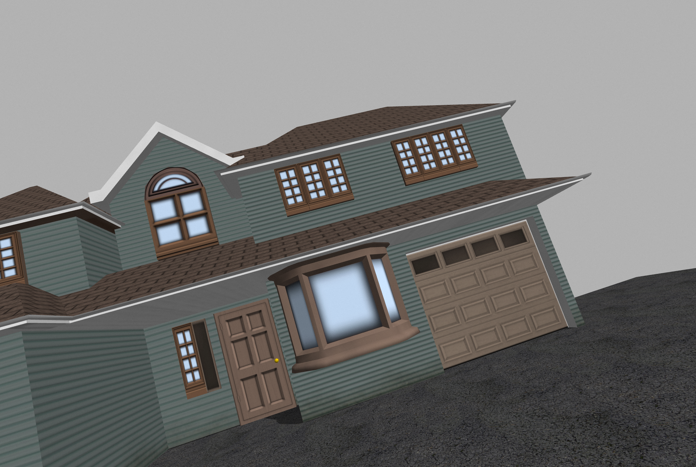
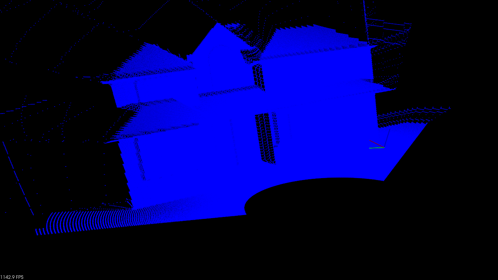
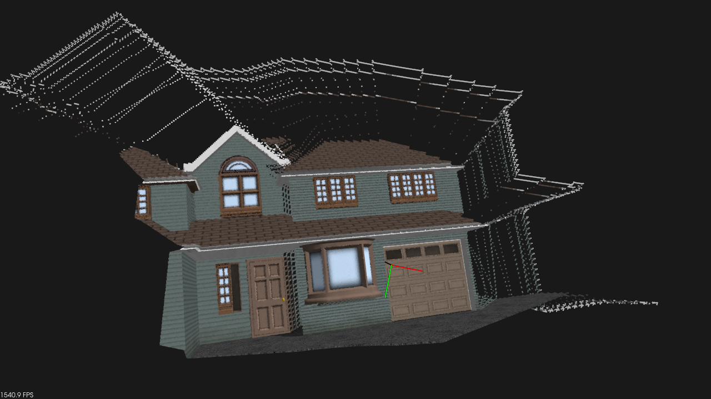

# VP_calib

`VP_calib` is a vanishing-point based camera-lidar calibration demo. The
current repository includes a small simulation dataset that can be used as the
default input for building and running the calibration pipeline.

## Simulation Dataset

The default dataset is stored in:

```text
bag_extract/
```

Important files:

```text
bag_extract/image_0001.png   # Camera image, 2048 x 1536
bag_extract/merged.pcd       # Merged lidar point cloud
```

The default runtime configuration is:

```text
config/default_data_groups.txt
```

It currently points to:


## Preview

Camera image:



Lidar point cloud:



Rendered colored lidar point cloud:



## Dependencies

On Ubuntu, install the main build dependencies:

```bash
sudo apt update
sudo apt install -y build-essential cmake libopencv-dev libpcl-dev libeigen3-dev libceres-dev
```

The project also uses OpenMP when it is available.

## Build

Run from the repository root:

```bash
mkdir -p build
cmake -S . -B build
cmake --build build -j$(nproc)
```

The executable is generated at:

```bash
build/src/VP_calib
```

## Run

Run with the default simulation dataset:

```bash
./build/src/VP_calib
```

Or run with another data-group file:

```bash
./build/src/VP_calib path/to/data_groups.txt
```

The program opens OpenCV/PCL visualization windows, so run it in an environment
with GUI support.


## Use Your Own Data

Create a data-group file with the same format as
`config/default_data_groups.txt`, then provide it when launching:

```bash
./build/src/VP_calib your_data_groups.txt
```

Each group should contain:

- `fileData`: lidar point cloud path, usually `.pcd`
- `img_filePath`: camera image path
- `camera_inner`: 3 x 3 camera intrinsic matrix, row-major
- `dist_coeffs`: 5 distortion coefficients

Multiple groups can be appended to the same file.

## Package File

`package.xml` is included as a basic package manifest for dependency metadata.
The current build remains a standard CMake build.
